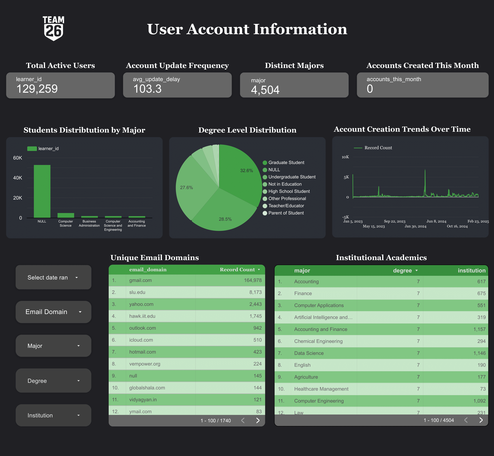
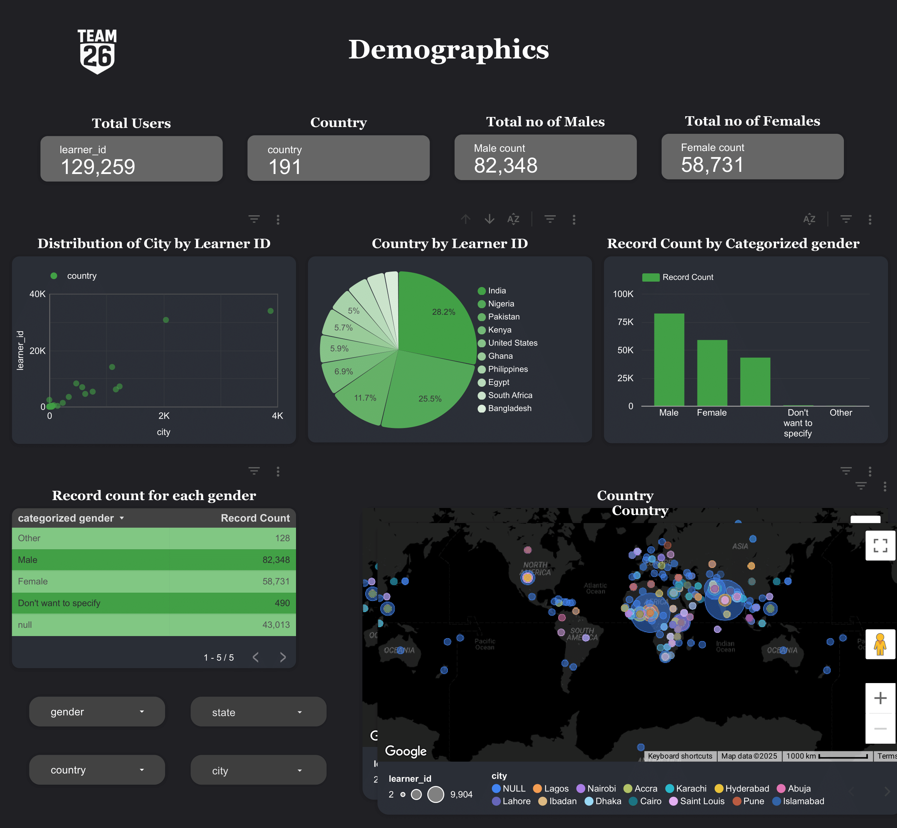
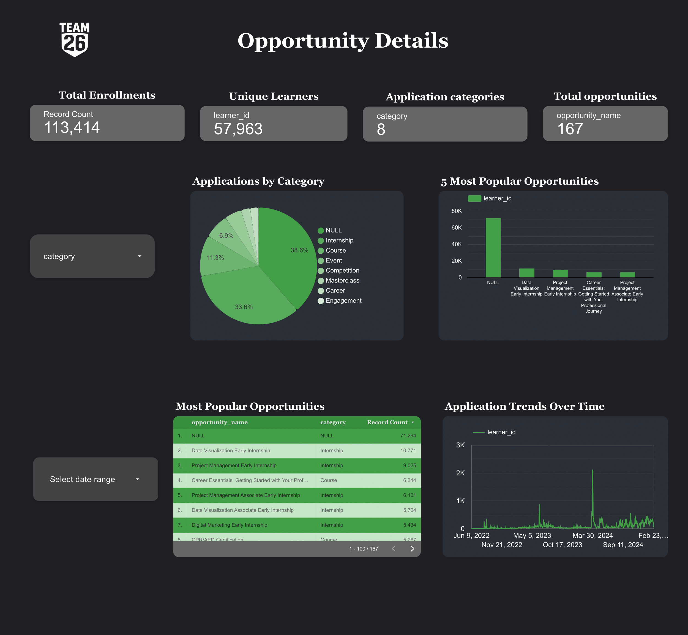
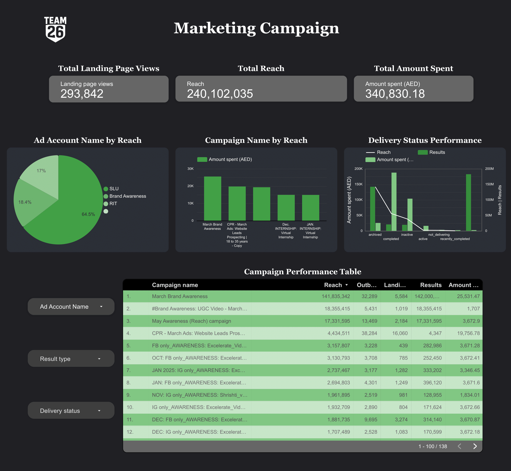

# 📊 Data Visualization Internship – Excelerate

## 📝 Overview
This repository contains the complete documentation and deliverables from our **1-month (4-week) internship** as **Data Visualization Associate Interns** at **Excelerate**, completed on **2nd July 2025**.  
Our 3-member team collaborated to transform **6 raw, real-life datasets** into **clean, structured data** and develop an **interactive Looker Studio dashboard** showcasing actionable insights.

---

## 🎯 Objectives
- **Clean, preprocess, and integrate** multiple datasets using PostgreSQL.
- **Design and build** interactive dashboards in Looker Studio.
- Perform **Exploratory Data Analysis (EDA)** for pattern discovery and insights.
- Create **weekly reports** summarizing progress, challenges, and findings.

---

## 🛠 Tools & Technologies
- **PostgreSQL** – Data cleaning, transformation, joining  
- **Looker Studio** – Interactive dashboard creation  
- **Excel / Google Sheets** – Sub-table creation, mapping table preparation  
- **Data Visualization Techniques** – Bar charts, line charts, pie charts, scatter plots  

---

## 📅 Weekly Progress

### **Week 1 – Dataset Familiarization & Initial Cleaning**
- Explored **6 provided raw datasets**.
- Checked for **NULL values, inconsistencies, and duplicates**.
- Standardized **column names, formats, and data types**.
- Cleaned individual datasets:
  - Removed unnecessary whitespace and special characters.
  - Standardized date formats.
  - Validated unique identifiers (e.g., `learner_id`).
- Prepared cleaned versions for further processing.

---

### **Week 2 – Master Table Creation & Integration**
- Created **Master Table** using PostgreSQL by joining 5 datasets on `learner_id`.
- Excluded `marketing_data.csv` due to missing relational keys.
- Built master tables from:
  1. **Raw datasets**
  2. **Cleaned datasets**
- Compared both versions:
  - Cleaned dataset had fewer NULLs and more consistent data types.
- Performed EDA on the Master Table:
  - Country-wise, gender-wise, and degree-level distribution.
  - Enrollment trends over time.
  - Institution-level participation analysis.

---

### **Week 3 – Dashboard Design & Supporting Tables**
- Designed a **dashboard wireframe**:
  - Filters (slicers) for user segmentation.
  - KPI section for quick performance metrics.
  - Charts: bar, pie, donut, line.
- Created **Mapping Table** to map relationships across datasets.
- Generated **5 sub-tables**:
  1. Regional Distribution
  2. Demographics
  3. Academic Background
  4. Opportunity Details
  5. User Account Information
- Conducted EDA on `marketing_data.csv`:
  - Analyzed ad reach, impressions, and clicks.
  - Identified issues with NULL rendering in Looker Studio and solved with `COALESCE()`.

---

### **Week 4 – Final Dashboard Development & Insights**
- Developed **4-page interactive dashboard** in Looker Studio:

**Page 1 – User Account Information**  
  
- Spikes in account creation in Aug 2023 & Mar 2024.
- Most accounts linked to `gmail.com`.
- Average profile update frequency: 103.3 days.

**Page 2 – Demographics**  
  
- Top majors: Computer Science, Engineering, Accounting.
- Majority: Graduate & Undergraduate degree levels.
- Location clusters: Lagos, Dhaka, Saint Louis.

**Page 3 – Opportunity Details**  
  
- 113,414 total enrollments.
- Internship = most popular category (38.6%).
- Top roles: Data Visualization Internship, Project Management Internship.

**Page 4 – Marketing Campaign**  
  
- 240M+ impressions, 293K+ landing page views.
- Top campaign: March Brand Awareness.
- Strong engagement metrics despite some missing data.

---

## 🔗 Live Dashboard
[**View Interactive Dashboard**](https://lookerstudio.google.com/u/0/reporting/30234d95-84b3-4627-9d7e-bc0f77f6a93c/page/p_szufop5utd?s=kDGl964JY5A)

---

## 📌 Key Learnings
- **Data Cleaning First**: Reduces NULL values and improves joins.
- **Sub-table Approach**: Speeds up dashboard creation.
- **BI Tool Limitations**: NULL handling requires preprocessing.
- **Collaboration**: Distributed tasks lead to efficient delivery.

---

## 👥 Team Members

### **Shomitra Dey Dipon**
- 🔗 [LinkedIn](https://www.linkedin.com/in/shomitra-dey)
- 📧 soumitradev532@gmail.com

### **Khushi Khati**
- 🔗 [LinkedIn](https://www.linkedin.com/in/khushi-k-11676b296)
- 📧 khushikhati11@gmail.com

### **Rohit Emmanuel**
- 🔗 [LinkedIn](https://www.linkedin.com/in/rohit-emmanuel-927a751bb)
- 📧 kingrohit2439@gmail.com
  

